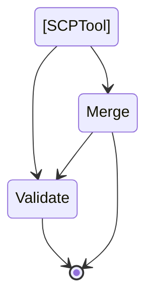

# scpkit
[](https://github.com/marketplace/actions/super-linter)

## What it is

This project is intended to accomplish two things

1. Create a collection of validated Service Control Policies that an AWS administrator may want to apply to their Org
2. With the current limit of 5 SCPs and a size limit on each of 5120 bytes, multiple SCPs need to be condensed into fewer policies. This tool will merge selected SCPs into the fewest amount of policies, and optionally remove whitespaces characters as they count toward the byte limit.




From the root of the folder:
```
python3 -m venv .venv
source .venv/bin/activate
pip install -r requirements
python -m scpkit.main validate --sourcefiles ./scps --profile yourawsprofile
```
Install as a package
```
python3 -m venv .venv
source .venv/bin/activate
pip3 install -U git+https://github.com/aquia-inc/scpkit.git
```
Collection of SCPs generated in part from:
* https://summitroute.com/blog/2020/03/25/aws_scp_best_practices/
* https://github.com/ScaleSec/terraform_aws_scp
* https://docs.aws.amazon.com/organizations/latest/userguide/orgs_manage_policies_scps_examples.html
* https://asecure.cloud/l/scp/
