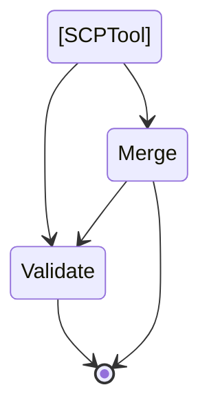

# SCPkit
[](https://github.com/aquia-inc/scpkit/actions/workflows/linter.yaml)

## Overview

This project provides a python module to aid in Service Control Policy management in AWS accounts. See our release [blog](https://blog.aquia.us/blog/) for additional details.

SCPs have a current limit of 5 total per entity, and a size limit on each of 5120 bytes. This tool will merge selected SCPs into the fewest amount of policies, and optionally remove whitespaces characters as they count toward the byte limit.



## Using SCPkit
SCPkit can be installed from PyPI
```
pip install scpkit
```

### Validating a directory of SCPs
Validating a directory requires active AWS credentials through a profile or environment. SCPkit will recursively search the directory for json files and validate them with [Access Analyzer](https://docs.aws.amazon.com/IAM/latest/UserGuide/access-analyzer-policy-validation.html)'s [ValidatePolicy API](https://docs.aws.amazon.com/access-analyzer/latest/APIReference/API_ValidatePolicy.html).
```
scpkit validate --sourcefiles /path/to/scps --profile yourawsprofile --outdir /path/to/findings
```

### Merging a directory of SCPs
Merging a directory of SCPs does not require active AWS credentials, but can optionally validate after merging.
```
scpkit merge --sourcefiles /path/to/scps --outdir /path/to/directory
```
Optional validation with output locally:
```
scpkit merge --sourcefiles /path/to/scps --outdir /path/to/directory --validate-after-merge --profile yourawsprofile
```

The full CLI is documented through docopt
```
SCPkit
Usage:
    main.py (validate | merge) [--sourcefiles sourcefiles] [--profile profile] [ --outdir outdir] [--validate-after-merge] [--readable]

Options:
    -h --help                   Show this screen.
    --version                   Show version.
    --sourcefiles sourcefiles   Directory path to SCP files in json format
    --outdir outdir             Directory to write new SCP files [Default: ./]
    --profile profile           AWS profile name
    --validate-after-merge      Validate the policies after merging them
    --readable                  Leave indentation and some whitespace to make the SCPs readable
```


## Local development
From the root of the folder:
```
python3 -m venv .venv
source .venv/bin/activate
pip install -r requirements
python -m scpkit.main validate --sourcefiles ./scps --profile yourawsprofile
```
Install as a package
```
python3 -m venv .venv
source .venv/bin/activate
pip3 install -U git+https://github.com/aquia-inc/scpkit.git
```

## References
This project would not be possible without the contributions of the following:
* https://summitroute.com/blog/2020/03/25/aws_scp_best_practices/
* https://github.com/ScaleSec/terraform_aws_scp
* https://docs.aws.amazon.com/organizations/latest/userguide/orgs_manage_policies_scps_examples.html
* https://asecure.cloud/l/scp/
* https://github.com/aws-samples/service-control-policy-examples
